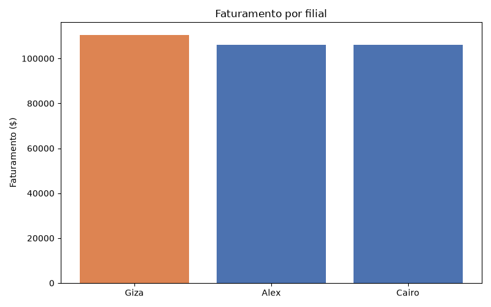
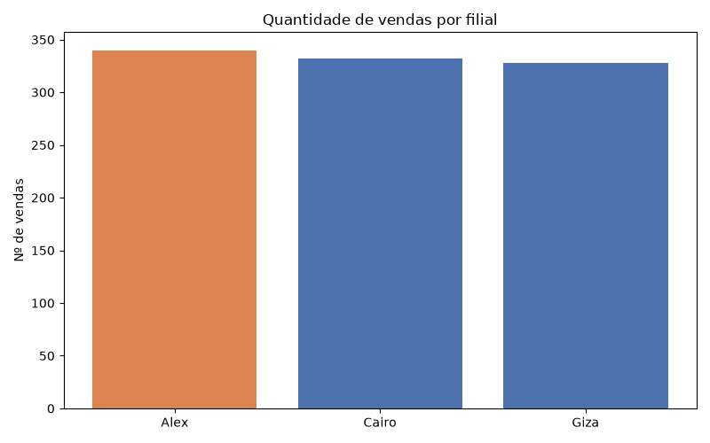
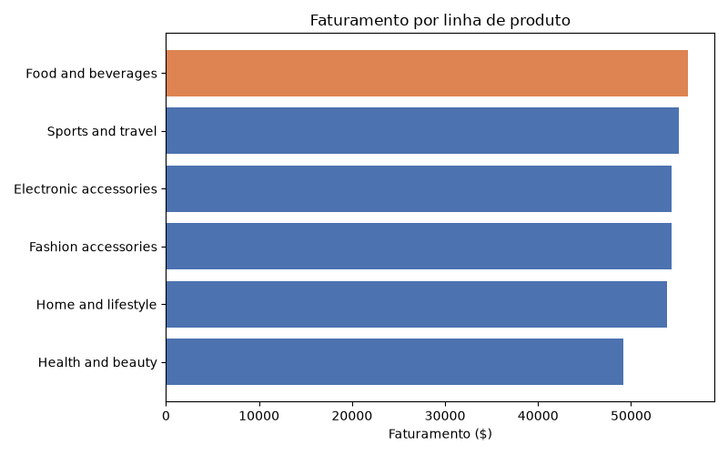
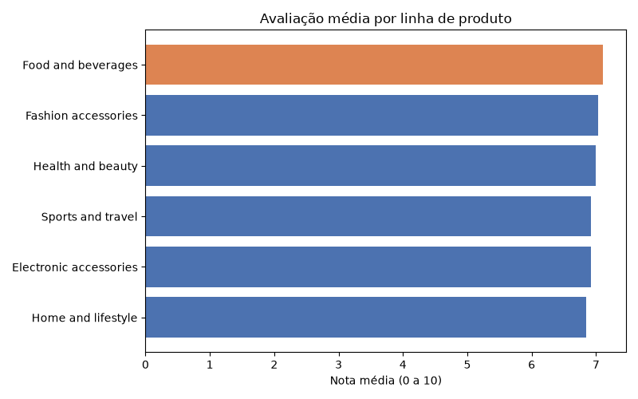
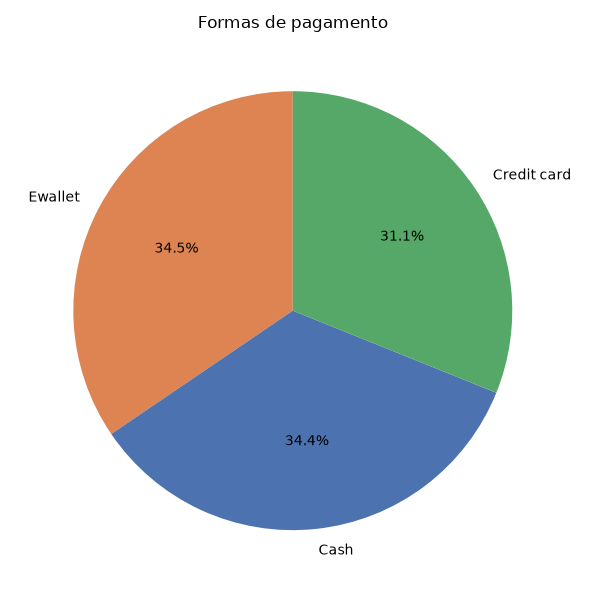
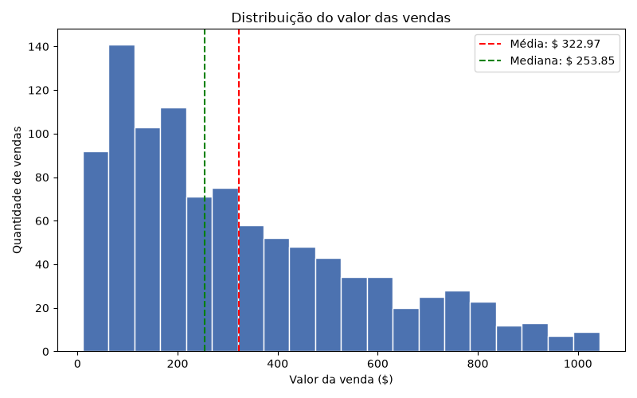
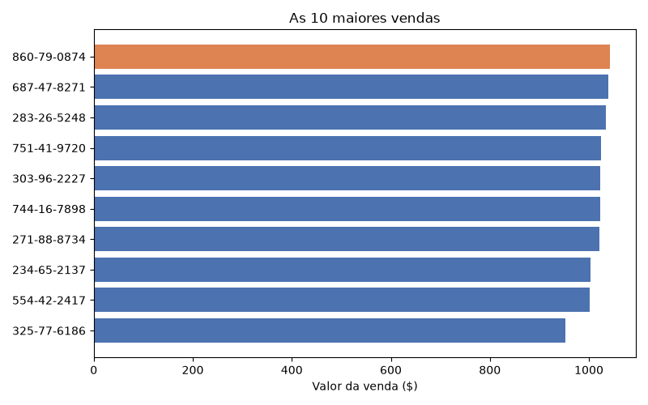
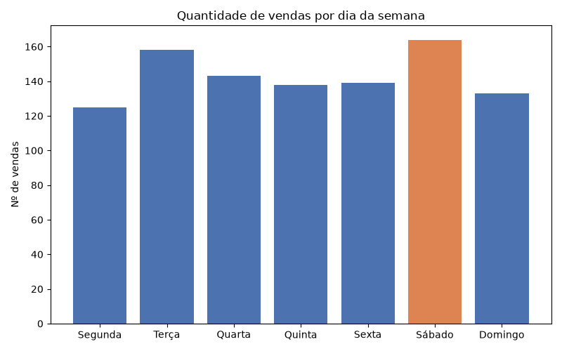

# Projeto ETL de Vendas – Supermarket Sales

Projeto avaliativo do Módulo 1 (Semana 13). Neste trabalho eu montei um fluxo
de dados do início ao fim: os dados de vendas de um supermercado vão do
arquivo CSV para o **PostgreSQL**, depois são tratados com **Python/Pandas**
e no final respondo perguntas de negócio com **estatística e gráficos**.

---

## 1. Contexto e objetivo

Uma rede de supermercados quer entender as vendas das suas filiais. Os dados
vieram em CSV, com nomes de colunas em inglês, datas em formato de texto e
números com muitas casas decimais. Por isso eles precisaram ser organizados
antes da análise.

**Perguntas que o projeto responde:**

1. Qual filial apresentou o maior faturamento?
2. Qual filial realizou a maior quantidade de vendas?
3. Qual linha de produto apresentou o maior faturamento?
4. Qual linha de produto recebeu a melhor avaliação média?
5. Qual foi a forma de pagamento mais utilizada?
6. Qual foi o valor médio das vendas?
7. Qual foi a maior venda registrada?
8. Em qual dia da semana ocorreu a maior quantidade de vendas?

**Fonte dos dados:** [Supermarket Sales – Kaggle](https://www.kaggle.com/datasets/faresashraf1001/supermarket-sales)
(1000 vendas, de janeiro a março de 2019, em 3 filiais).

---

## 2. Tecnologias utilizadas

| Tecnologia                      | Para que usei                                            |
| ------------------------------- | -------------------------------------------------------- |
| **PostgreSQL**            | Banco de dados: tabelas Raw e Tratada                    |
| **SQL**                   | Criação das tabelas, consultas e exportação para CSV |
| **Python 3**              | Linguagem dos scripts de ETL e análise                  |
| **Pandas**                | Leitura, limpeza, tipagem e estatística                 |
| **Matplotlib**            | Gráficos                                                |
| **SQLAlchemy + psycopg2** | Conexão do Python com o PostgreSQL                      |
| **python-dotenv**         | Ler as credenciais do arquivo`.env`                    |
| **Git e GitHub**          | Controle de versão                                      |

---

## 3. Arquitetura (inspirada na Medallion)

| Camada      | O que é                                  | Onde fica                                                           |
| ----------- | ----------------------------------------- | ------------------------------------------------------------------- |
| Raw (Bruta) | Cópia fiel do CSV original               | Tabela`raw_vendas` / `data/raw/`                                |
| Tratada     | Dados limpos, tipados e com colunas novas | `data/processed/vendas_tratadas.csv` e tabela `vendas_tratadas` |
| Resultados  | Métricas, estatísticas e gráficos      | `resultados/`                                                     |

## 4. Como executar

### 4.1 Pré-requisitos

- PostgreSQL instalado e rodando
- Python 3.10 ou superior
- Git

### 4.2 Preparar o ambiente

```bash
# Clonar o repositório
git clone <link-do-repositorio>
cd projeto_etl_vendas

# Criar e ativar o ambiente virtual
python -m venv venv
venv\Scripts\activate        # Windows
# source venv/bin/activate   # Linux/Mac

# Instalar as bibliotecas
pip install -r requirements.txt
```

### 4.3 Configurar as credenciais

Copie o arquivo `.env.example` para `.env` e coloque a sua senha do PostgreSQL:

```
SM_USUARIO=postgres
SM_SENHA=sua_senha_aqui
SM_HOST=localhost
SM_PORTA=5432
SM_BANCO=base_supermarket
```

> O `.env` está no `.gitignore`, então a senha não vai para o GitHub.

### 4.4 Rodar o pipeline (na pasta do projeto, nesta ordem)

```bash
# Fase 0 - Banco e tabelas
psql -U postgres -f sql/01_criar_banco.sql
psql -U postgres -d base_supermarket -f sql/02_criar_tabelas.sql

# Fase 1 - Carga Raw
python src/00_carga_raw.py

# Fase 2 - Consultas e exportação para CSV
psql -U postgres -d base_supermarket -f sql/03_consultas.sql

# Fase 3 - Leitura, inspeção e ETL
python src/01_leitura_dados.py
python src/02_etl_vendas.py

# Fase 4 - Estatística e respostas de negócio
python src/03_estatistica.py
```

---

## 5. O que cada fase faz

### Fase 0 – Banco e tabelas

- `raw_vendas`: todas as colunas como `TEXT`, para guardar o dado exatamente
  como veio. Também tem `arquivo_origem` e `data_carga` (rastreabilidade).
- `vendas_tratadas`: segue o dicionário de dados, com:
  - **PRIMARY KEY** em `id_venda`;
  - **NOT NULL** nos campos obrigatórios (filial, cidade, linha, valores, data...);
  - **CHECK** em preço, quantidade, imposto, valores (>= 0 ou > 0),
    avaliação (0 a 10) e formas de pagamento válidas.

### Fase 1 – Carga Raw

O CSV é lido com `dtype=str` (tudo como texto) e gravado no banco. No final o
script confere se as 1000 linhas do CSV chegaram na tabela.

### Fase 2 – Consultas SQL

Consultas com `SELECT`, `WHERE`, `GROUP BY`, `HAVING`, `ORDER BY`, `COUNT`,
`SUM`, `AVG`, `MIN` e `MAX`. A base é exportada com `\copy` para
`data/raw/vendas_exportadas.csv`.

### Fase 3 – Leitura e ETL com Pandas

**Inspeção (`01_leitura_dados.py`):** tamanho, tipos, nulos, duplicados,
valores únicos e `describe()`. Problemas encontrados:

- data e hora como texto (`1/5/2019`, `1:08:00 PM`);
- colunas em inglês e com espaços;
- números com até 4 casas decimais.

**Transformação (`02_etl_vendas.py`):**

| Etapa         | O que foi feito                                                                                                         |
| ------------- | ----------------------------------------------------------------------------------------------------------------------- |
| Renomear      | Colunas para português (`Branch` → `filial`)                                                                      |
| Limpar textos | `str.strip()`                                                                                                         |
| Tipagem       | `to_numeric`, `to_datetime` (M/D/AAAA) e hora 12h → 24h                                                            |
| Nulos         | Verificados; opcionais preenchidos, obrigatórios removidos (0 casos)                                                   |
| Duplicados    | Removidos por linha e por`id_venda` (0 casos)                                                                         |
| Regras        | Mesmas regras do CHECK do banco (1000 linhas aprovadas)                                                                 |
| Conferência  | `valor_total = preço × quantidade + imposto` (todas batem)                                                          |
| Colunas novas | `ano`, `mes`, `nome_mes`, `dia_semana`, `hora`, `periodo_dia`, `faixa_valor`, `classificacao_avaliacao` |

Saída: `data/processed/vendas_tratadas.csv` + tabela `vendas_tratadas`.
Detalhes no [dicionário de dados](data/processed/dicionario_dados.md).

### Fase 4 – Estatística e respostas

Média, mediana, moda, desvio padrão, quartis, amplitude e coeficiente de
variação (`resultados/estatisticas_descritivas.csv`), mais um gráfico para
cada pergunta.

---

## 7. Resultados

| Pergunta                      | Resposta                                         |
| ----------------------------- | ------------------------------------------------ |
| Filial com maior faturamento  | **Giza** – $ 110.568,71                   |
| Filial com mais vendas        | **Alex** – 340 vendas                     |
| Linha com maior faturamento   | **Food and beverages** – $ 56.144,86      |
| Linha com melhor avaliação  | **Food and beverages** – nota 7,11        |
| Forma de pagamento mais usada | **Ewallet** – 345 vendas (34,5%)          |
| Valor médio das vendas       | **$ 322,97** (mediana $ 253,85)            |
| Maior venda                   | **$ 1.042,65** – venda 860-79-0874 (Giza) |
| Dia com mais vendas           | **Sábado** – 164 vendas                  |

### Principais aprendizados

- **Mais vendas não significa mais faturamento:** Alex vendeu mais vezes, mas
  Giza faturou mais porque o ticket médio dela é maior ($ 337,10).
- **As filiais estão equilibradas:** a diferença entre a primeira e a última
  é de só $ 4.370,97.
- **Food and beverages** é a melhor linha nas duas métricas (faturamento e nota).
- **Média maior que a mediana:** existem poucas vendas de valor alto que
  puxam a média para cima.
- **Formas de pagamento** quase empatadas: Ewallet (345) e Cash (344).

### Gráficos

|                                                        |                                                           |
| ------------------------------------------------------ | --------------------------------------------------------- |
|  |          |
|   |        |
|        |  |
|          |      |

Análise completa, com hipóteses: [resultados/respostas_negocio.md](resultados/respostas_negocio.md)

---

## 8. Versionamento (Git)

Os commits seguem o padrão **Conventional Commits**:

| Prefixo       | Uso                                       |
| ------------- | ----------------------------------------- |
| `feat:`     | nova funcionalidade (script, consulta)    |
| `fix:`      | correção                                |
| `docs:`     | documentação (README, dicionário)      |
| `chore:`    | configuração (.gitignore, requirements) |
| `refactor:` | melhoria de código sem mudar o resultado |

Exemplos: `feat(sql): cria tabelas raw e tratada com constraints`,
`feat(etl): converte tipos e cria colunas derivadas`,
`docs(readme): adiciona resultados e instruções de execução`.

---

## 9. Autoria

Aline dos Santos – Projeto Avaliativo do Módulo 1, Semana 13.
